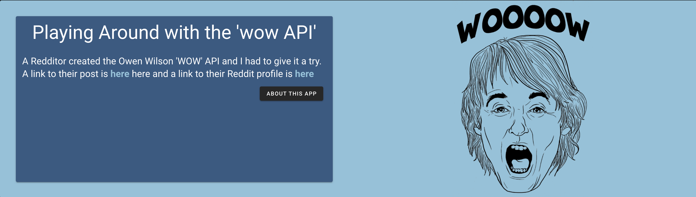

<div align="center">

  
  <h1>WooW</h1>
  
  <p>
    An exercise in consuming APIs
  </p>

  
<!-- Badges -->
<p>
  <a href="https://github.com/awolfe89/awesome-readme-template/graphs/contributors">
    
  </a>
  <a href="">
    
  </a>
  <a href="https://github.com/awolfe89/awesome-readme-template/network/members">
    
  </a>
  <a href="https://github.com/awolfe89/awesome-readme-template/stargazers">
    
  </a>
  <a href="https://github.com/awolfe89/awesome-readme-template/issues/">
    
  </a>
  <a href="https://github.com/awolfe89/awesome-readme-template/blob/master/LICENSE">
    
  </a>
</p>
   
<h4>
    <!-- <a href="https://github.com/awolfe89/awesome-readme-template/">View Demo</a>
  <span> · </span> -->
    <a href="https://github.com/awolfe89/awesome-readme-template">Documentation</a>
  <span> · </span>
    <a href="https://github.com/awolfe89/awesome-readme-template/issues/">Report Bug</a>
  <span> · </span>
    <a href="https://github.com/awolfe89/awesome-readme-template/issues/">Request Feature</a>
  </h4>
</div>

<br />

<!-- Table of Contents -->
# :notebook_with_decorative_cover: Table of Contents

- [About the Project](#star2-about-the-project)
  * [Tech Stack](#space_invader-tech-stack)
  * [Features](#dart-features)
  * [Color Reference](#art-color-reference)
  * [Environment Variables](#key-environment-variables)
- [Getting Started](#toolbox-getting-started)
  * [Prerequisites](#bangbang-prerequisites)
  * [Installation](#gear-installation)
  * [Run Locally](#running-run-locally)
- [Usage](#eyes-usage)
- [Roadmap](#compass-roadmap)
- [Contributing](#wave-contributing)
  * [Code of Conduct](#scroll-code-of-conduct)
- [License](#warning-license)
- [Contact](#handshake-contact)
- [Acknowledgements](#gem-acknowledgements)
  

<!-- About the Project -->
## :star2: About the Project

<div align="center"> 
  
</div>


<!-- TechStack -->
### :space_invader: Tech Stack

<details>
  <summary>Client</summary>
  <ul>
    <li><a href="https://www.nuxtjs.org/">Nuxt</a></li>
    <li><a href="https://nextjs.org/">Vue.js</a></li>
    <li><a href="https://vuetifyjs.com/">Vuetify (CSS)</a></li>
    <li><a href="#">Axios</a></li>
  </ul>
</details>

<details>
  <summary>Server</summary>
  <ul>
    <li><a href="#">n/a</a></li>
  </ul>
</details>


<!-- Features -->
### :dart: Features

- Pull Random Owen Wilson "WOW"
- Get a list of 5 movies where Owen Wilson says "WOW"
- Select a number of movies in which Owen Wilson says "WOW"

<!-- Color Reference -->
### :art: Color Reference

| Color             | Hex                                                                |
| ----------------- | ------------------------------------------------------------------ |
| bright |  #EE6C4D |
| dblue |  #3D5A80 |
| card |  #98C1D9 |
| cardHeadline |  #E0FBFC |
| cardText |  #293241 |

color pallette generated from <a href="www.coolers.io">Coolers.io</a>, specific pallette <a href="https://coolors.co/palette/3d5a80-98c1d9-e0fbfc-ee6c4d-293241">here</a>


<!-- Env Variables -->
### :key: Environment Variables

Here's where I may add some environment variables if they're required. I should store the main API URL in an ENV, but so far, I simply have it hard coded in the nuxt.config

<!-- `API_KEY`

`ANOTHER_API_KEY` -->

<!-- Getting Started -->
## 	:toolbox: Getting Started

<!-- Prerequisites -->
### :bangbang: Prerequisites

This project uses NPM as package manager


<!-- Installation -->
### :gear: Installation

Once the repo is pulled from github CD into the root and run 

NPM i 


<!-- Run Locally -->
### :running: Run Locally

Clone the project

```bash
  git clone https://github.com/awolfe89/woow.git
```

Go to the project directory

```bash
  cd my-project
```

Install dependencies

```bash
  npm install
```

Start the server

```bash
  $ npm run dev
```

build for production and launch server
```bash
$ npm run build
$ npm run start
```

generate static project
```bash
$ npm run generate
```
For detailed explanation on how things work with NuxtJS, check out their [documentation](https://nuxtjs.org).
<!-- Usage -->
## :eyes: Usage

This is a simple Nuxt app that calls an Owen Wilson API that a Redditor created on /r/webdev using axios and renders the data using Vue/Vuetify on the front end.

The entire app (not that it is very big), uses components which are coded and then imported into a given page as can be seen in the code for our 'home' page below

```javascript

  <v-row justify="center" align="center" no-gutters>
    <v-col cols="12" lg="12">
      <Hero />
      <RandomCard />
      <Multiple />
      <Year />
    </v-col>
  </v-row>


import Hero from '../components/Hero'
import RandomCard from '../components/RandomCard'
import Multiple from '../components/Multiple'
import Year from '../components/Year'
export default {
  name: 'IndexPage',
  components:{
    Hero,
    RandomCard,
    Multiple,
    Year  
  },
}


```
This keeps things neat and tidy.
<!-- Roadmap -->
## :compass: Roadmap

* [x] Call various endpoints to display data
* [x] Use template literals to call various API parameters
* [ ] Use the data in a more entertaining way - perhaps a trivia game using the data fetched by the API 

<!-- Contributing -->
## :wave: Contributing

<a href="https://github.com/awolfe89/wooow/graphs/contributors">
</a>


Contributions are always welcome!

See `contributing.md` for ways to get started.


<!-- Code of Conduct -->
### :scroll: Code of Conduct

There is none :) 


<!-- License -->
## :warning: License

Distributed under the no License. 


<!-- Contact -->
## :handshake: Contact

Allan - admin@methodpet.com


<!-- Acknowledgments -->
## :gem: Acknowledgements

Use this section to mention useful resources and libraries that you have used in your projects.

 - [Owen Wilson API Reddit Link](https://old.reddit.com/r/webdev/comments/u118io/i_built_an_api_for_owen_wilsons_wows/)

